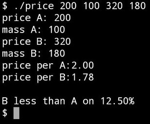

# Price-Compare

This is a small utilite for compare prices of 2 different products.
v0.1 written on C.

Current version on Python 3.8+

## Usage.
v0.2: 
in unix-like, macOS, and other terminal run:
> python ./python/price.py
and follow instructions

v0.1: 
in unix-like, macOS, and other terminal run:
> ./price price_A mass_A price_B mass_B

